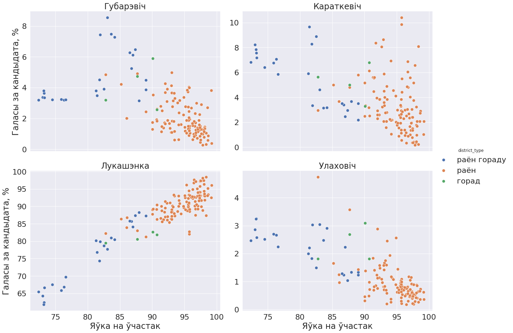
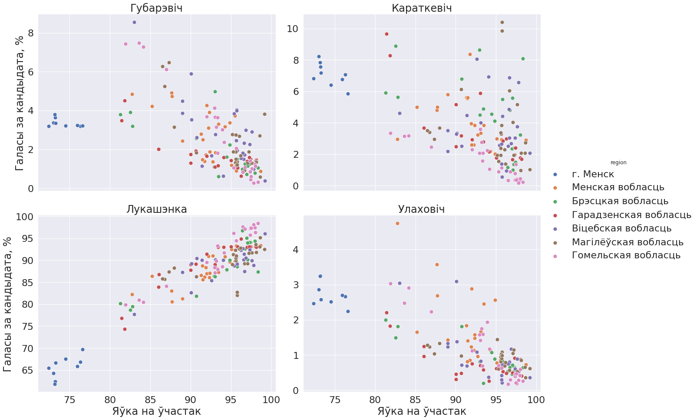
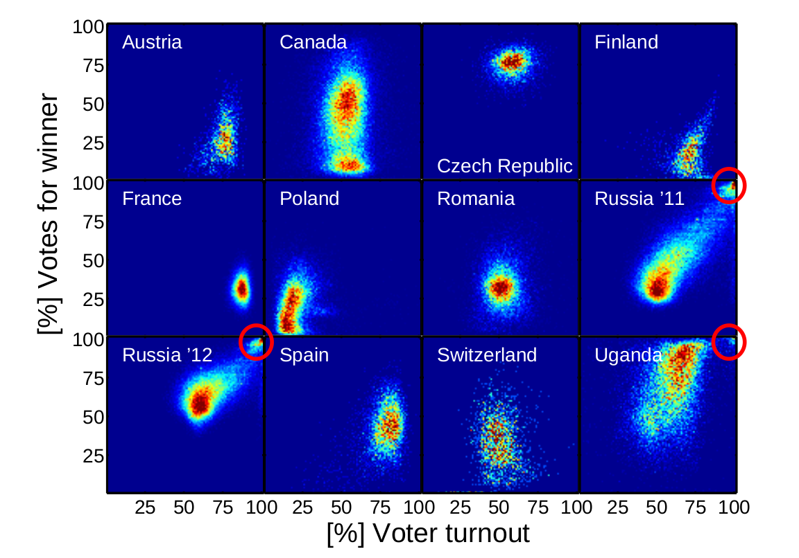

## Выбары прэзідэнта Рэспублікі Беларусь 2015

Мэтай дадзенага праэкту з'яўляецца статыстычны аналіз 
выбараў прэзідэнта Рэспублікі Беларусь у 2015 годзе.

Інфармацыя для аналізу бралася з 
[афіцыйнага сайту Цэнтральнай выбарчай камісіі РБ](http://www.rec.gov.by/dokumenty).

Мінімальнай тэрытарыяльнай адзінкай у дадзеных з'яўлецца раён.





### Стварэнне датасэту

1. Дадзеныя з `.pdf` файлаў са справаздачамі ЦВК па кожнай з абласцей 
пераносіліся ў `.xlsx` файл. 

   Атрыманы `.xlsx` файл знаходзіцца ў `data/original/Vybary_2015_rajonnaja_statystyka.xlsx`

2. Табліцы знутры `.xlsx` файлу аб'ядноўваліся ў адну агульную табліцу. 
   Назва калонак змянялася на зручную ў апрацоўцы. 
   
   Атрыманы датасэт быў захаваны ў фармаце `.xlsx` і `.csv`:
   `data/output/Vybary_2015.csv`  
   `data/output/Vybary_2015.xlsx`
   
Стварэнне датасэту па ўваходнай `.xlsx` табліцы з пункту 1
праводзіцца ў ноўтбуку `notebooks/create_dataset.ipynb`
   
### Праверка памылак
Быў створаны ноўтбук для выўляення памылак 
пры пераносе дадзеных з `.pdf` справаздачаў у табліцы, 
а таксама для праверкі магчымых памылак з боку ЦВК.

* Стварэнне датасэту з інфармацыяй пра вынікі выбараў 2015 году
на ўзроўні раёнаў па табліцы.

#### Дарабіць:
Набор тэстаў у ноўтбуку не пакрывае наступныя калонкі:
* выбарцы агулам
* новыя выбарцы
* атрыманыя бюлетэні

Неабходна выявіць наяўнасць хібаў у гэтых калонках.

### Аналіз

Ідэяй для аналізу стала даследаванне [Statistical detection of
systematic election irregularities, Klimek et al](https://arxiv.org/abs/1201.3087),
дзе паказваецца, што наяўнасць фальсіфікацыяў можна выявіць 
па форме супольнага размеркавання долі галасоў за кандыдата і яўкі выбарцаў.

На фота ніжэй чырвоным вылучаны пункты размеркавання, якія адпавядаюць
выбарчым участкам / раёнам з высокай яўкай і высокай доляй галасоў за кандыдата, 
які перамог на выбарах. Для вылучаных графікаў, якія адпавядаюць выбарам у Расіі і Угандзе,
аўтары даследавання не змаглі выявіць прычыну такога яўнага адхілення размеркавання 
ад нармальнага. Гэта можа сведчыць пра наяўнасць фальсіфікацыяў.



Аналіз праводзіўся ў ноўтбуку `notebooks/explore.ipynb` 

### Запуск коду

Для запуску код неабходна ўсталяваць Python3 і стварыць віртуальны асяродак:
```
python3 -m venv venv
source venv/bin/activate
pip3 install -r requirements.txt
```

Усталяваць асродак аўтаматычна, а таксама наладзіць пашырэнні 
для Jupyter Notebook можна з дапамогай адмысловага скрыпту:

`$ source venv_creation.sh`

Іншы скрыпт запускае ноўтбукі:

`$ bash run_jupyter.sh` 

### Далейшая работа

Для рэзультатаў выбараў былі пабудаваныя толькі асноўныя графікі, 
па аналогіі з графікамі ў даследаванні.

Сабраны датасэт можна карыстаць для правядзення далейшага большы дэтальнага аналізу.
Некаторыя ідэі для аналізу пазначаныя ў ноўтбуку. 